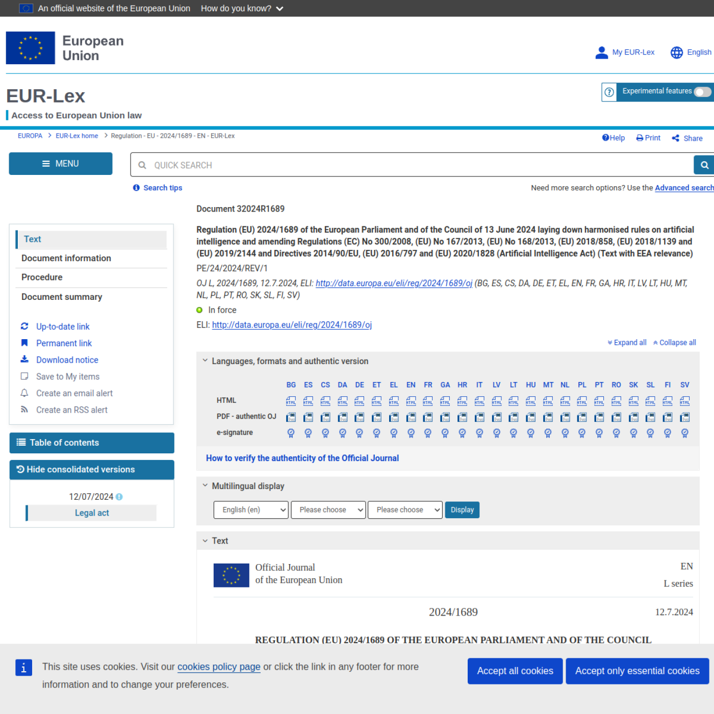

# EU — AI Act (Regulation (EU) 2024/1689)

## Standard Profile
- **Domain:** Governance
- **Pack ID:** `eu-ai-act`
- **Version:** `2024-1689`
- **Jurisdiction:** European Union
- **Type:** Regulation

## Official Standard Link
- [EU — AI Act (Regulation (EU) 2024/1689)](https://eur-lex.europa.eu/eli/reg/2024/1689/oj/eng)

## Website Screenshot

## Brief Info
Reference checklist pack for EU — AI Act (Regulation (EU) 2024/1689). Jurisdiction: European Union. Type: Regulation.

## How This Is Used In TrustStack
This standard is represented as a versioned pack and contributes checklist controls, expected evidence, and audit-ready mapping context.
