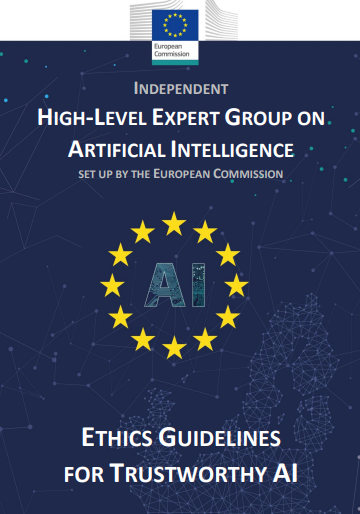

# EU HLEG — Ethics Guidelines for Trustworthy AI (2019)

## Standard Profile
- **Domain:** Safety
- **Pack ID:** `saf-15-eu-hleg-ethics-guidelines-for-trustworthy-ai-2019`
- **Version:** `1.0`
- **Jurisdiction:** European Union
- **Type:** Guidelines (non-binding)

## Official Standard Link
- [EU HLEG — Ethics Guidelines for Trustworthy AI (2019)](https://www.europarl.europa.eu/cmsdata/196377/AI%20HLEG_Ethics%20Guidelines%20for%20Trustworthy%20AI.pdf)

## Website Screenshot

## Brief Info
Reference checklist pack for EU HLEG — Ethics Guidelines for Trustworthy AI (2019). Jurisdiction: European Union. Type: Guidelines (non-binding).

## How This Is Used In TrustStack
This standard is represented as a versioned pack and contributes checklist controls, expected evidence, and audit-ready mapping context.
